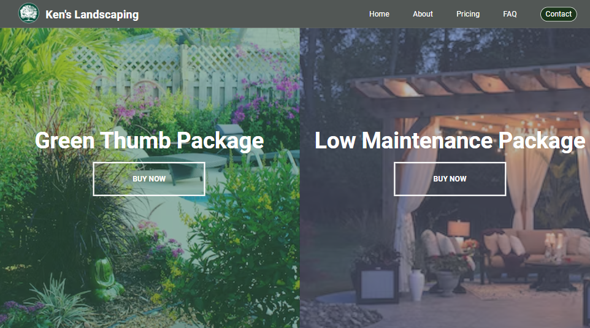

# Landscape Landing Page

This is a modification to the [Split Landing Page project (Day 7) in the Udemy course 50 projects in 50 Days](https://www.udemy.com/course/50-projects-50-days/?src=sac&kw=50+projects+50+days).

## Project Details

The goal of the initial project was to have the browser open with a split screen holding two product images with overlays and the option to purchase the products. I wanted to utilize this base code in a landing page for a landscaping company. To accomplish this, I had to:

- Create a navigation bar with a logo and links to other pages on the site.
- Adjust styles to accommodate the new headers.
- Add media queries to apply a responsive design.

### View My Project: 

## Features

- Page loads with split screen that highlights two landscape packages.
- The screen for each package increases or decreases with mouseover.

## Technologies Used

- HTML5
- CSS3
- JavaScript

## My Process

- Start the files from a boiler template.
- Code the basic HTML to reflect the original project with the addition of a navigation bar that holds a logo and links.
- Add the CSS styles to reflect the original project with changes to overlay and button colors.
- Create and add the logo to the navigation bar and adjust the number of nav items.
- Add a media query for medium screens and style the contact button.
- Turn nav items into links and add effects for them on hover. 
- Change opacity of overlay to reveal more detail of images.
- Apply media queries for smaller screens. (This was a point where I needed to really evaluate the new layout and how I wanted the elements to respond here.)

### Continued development

Although a majority of applications are coded mobile first for responsive design, this particular project was designed for a desktop format first. Creating a responsive design from desktop to mobile has always been a challenge for me. This project allowed me to exercise my responsive development skills when going from desktop to mobile layouts.

## Acknowledgements

Original Project idea: Brad Traversy, Florin Pop [Udemy course 50 Projects in 50 Days](https://www.udemy.com/course/50-projects-50-days/?src=sac&kw=50+projects+50+days)

Original HTML, CSS & Javascript provided by: Brad Traversy, Florin Pop [Udemy course 50 Projects in 50 Days](https://www.udemy.com/course/50-projects-50-days/?src=sac&kw=50+projects+50+days)

Background Images: [Randy Fath](https://unsplash.com/@randyfath) and [Jennifer Marcus](https://unsplash.com/@jennifire24) on [Unsplash](https://unsplash.com/it/foto/Ib2-XAeuUQg)
